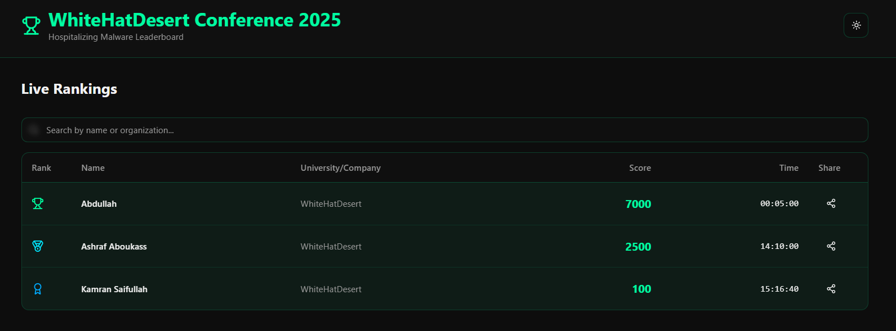
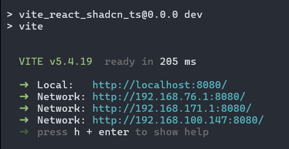
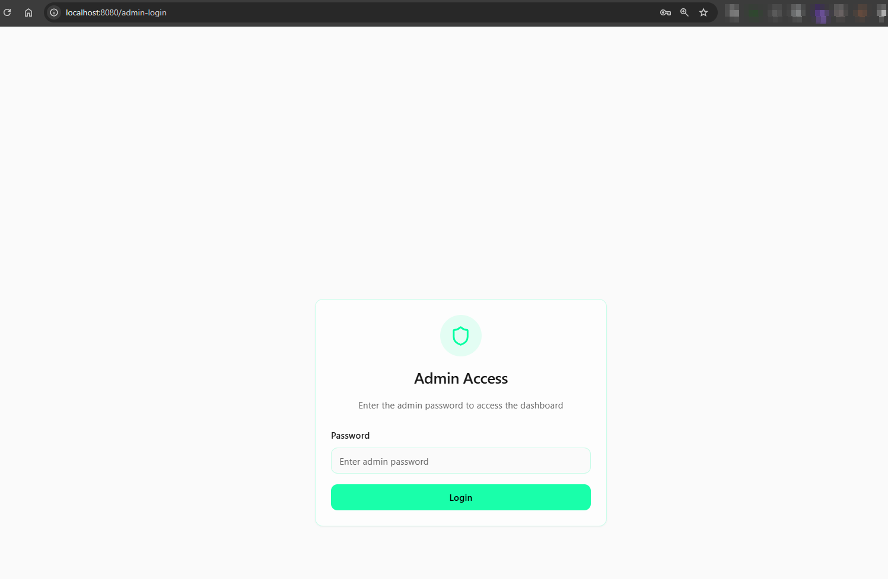

# WhiteHatDesert 2025 - Leaderboard 



# Changing Password

You need to ensure that you change the default password if you have to make this website publicly available to everyone, in case you are hosting it locally you can go with the default password i.e. `admin`, but better to have it changed in the below mentioned file on `line 10`.

```
src\pages\AdminLogin.tsx
```

# Building The Project

```
npm i
npm run dev
```

This will have the app running locally on your machine, similarly you can have it hosted anywhere as you like. 

```
http://localhost:8080/
```



# Usage 

The admin login page is located at `/admin-login` while the leaderboard is located at `/leaderboard/`, after successful login you will be redirected to `/admin` where you can basically chagne your village name and details, while add the scores. 




You can also have the overall data saved in a CSV file (Recommended) at the end of the conference. 

# Note

All you need to do is to manage the data within the `/admin` dashboard after you have logged in successfully. You can have a timer in place or can find other ways to run the CTF and have the scores added into the platform. 

Please feel free to make changes as you like, as i will be running `Malware Village`, i will be adding the scores and the time manually as i dont want people/students to get infected by the `samples`. 